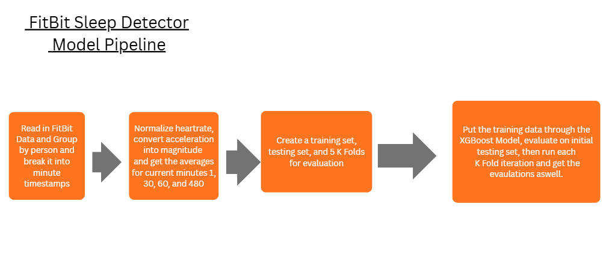

# DTSC_300_First_Repository
First Repository for Big Data and Databases classes at Duquense

HW#2

Question 1: How do you fill in the missing dates from the grants data?
1. I filled missing dates by using the column 'Project Start', and if 
that did not have the value, I just used null. It reduced the number
of null entries from 264 to 3.

Question 2: PI_NAMEs contains multiple names. We can only connect individual people. Can you make it so that we can get "grantees"?

2. The simplest option in my opinion is to make a new dataframe with the grantees. This
dataframe now has a column for the application id and then the grantee, and has a row
for each of them

Code for these is available on grants.py

3. The dates for Articles are problematic. Can you fix them?
We fix PubDate and DateCompleted here
Before, it was getting tag text after pubDate, which was always \n.
We change this by going deeper into the XML structure, getting year, month, day
and then reformatting it as a string, storing this date. 

Code for these is available on articles.py

HW#3

Create the best possible classifier of sleep from acceleration and heart rate

Best Model Features I used:

Wanted to normalize all features to a scale of each person, and then keep rolling averages
of heart rate and acceleration. I combined all acceleration into just a magnitude feature, 
as this would be more meaningful than having three seperate features.

'hr_norm'  -> Heart rate normalized for that person
'hr_norm_30m' -> mean normalized Heart rate for that person in the last 30 minutes
'acc_mag_norm' -> acceleration vector magnitude normalized for that person
'acc_mag_norm_30m' -> acceleration movement vector magnitude normalized for that person last 30 minutes
'acc_mag_norm_60m' -> acceleration movement vector magnitude normalized for that person last 60 minutes
'acc_mag_norm_480m' -> acceleration movemt vector magnitude normalized for that person last 8 hours
'hr_norm_60m' -> mean normalized Heart rate for that person in the last 60 minutes
'hr_norm_480m' -> mean normalized Heart rate for that person in the last 8 hours

Best Model Results I found:

Best threshold: 0.6724352673232223
Precision: 0.6461538461538462
Recall: 0.7
F1: 0.671999995008

              precision    recall  f1-score   support

       False       0.97      0.96      0.96       520
        True       0.65      0.70      0.67        60

    accuracy                           0.93       580
   macro avg       0.81      0.83      0.82       580
weighted avg       0.93      0.93      0.93       580

[[497  23]
 [ 18  42]]
ROC AUC: 0.9471153846153846
acc_mag_norm         0.271254
acc_mag_norm_30m     0.159674
hr_norm_480m         0.123686
acc_mag_norm_480m    0.120098
acc_mag_norm_60m     0.118934
hr_norm_60m          0.082632
hr_norm_30m          0.076491
hr_norm              0.047230
dtype: float64
Best threshold: 0.7163764470955606
Precision: 0.803921568627451
Recall: 0.6721311475409836
F1: 0.732142852182717
Fold 1 | AUC: 0.940 | Precision: 0.804 | Recall: 0.672 | F1: 0.732
Best threshold: 0.46816520847102866
Precision: 0.53
Recall: 0.8833333333333333
F1: 0.6624999953125
Fold 2 | AUC: 0.935 | Precision: 0.530 | Recall: 0.883 | F1: 0.662
Best threshold: 0.6373048624729275
Precision: 0.7678571428571429
Recall: 0.7166666666666667
F1: 0.741379305350773
Fold 3 | AUC: 0.946 | Precision: 0.768 | Recall: 0.717 | F1: 0.741
Best threshold: 0.596213979235793
Precision: 0.6949152542372882
Recall: 0.6833333333333333
F1: 0.6890756252524539
Fold 4 | AUC: 0.942 | Precision: 0.695 | Recall: 0.683 | F1: 0.689
Best threshold: 0.532619798572882
Precision: 0.676056338028169
Recall: 0.8
F1: 0.7328244225161705
Fold 5 | AUC: 0.940 | Precision: 0.676 | Recall: 0.800 | F1: 0.733

===== Cross-Validation Summary =====
AUC:       0.941 ± 0.004
Precision: 0.695 ± 0.095
Recall:    0.751 ± 0.080
F1 Score:  0.712 ± 0.031

#HW 4

Results with the XGBoost Model:

Best threshold: 0.36438751220703125
Precision: 0.7096774193548387
Recall: 0.7333333333333333
F1: 0.7213114704111798

              precision    recall  f1-score   support

       False       0.97      0.97      0.97       520
        True       0.71      0.73      0.72        60

    accuracy                           0.94       580
   macro avg       0.84      0.85      0.84       580
weighted avg       0.94      0.94      0.94       580

[[502  18]
 [ 16  44]]
ROC AUC: 0.9393269230769231
acc_mag_norm         0.234025
acc_mag_norm_30m     0.142753
hr_norm_480m         0.133681
acc_mag_norm_480m    0.119540
hr_norm_30m          0.115454
acc_mag_norm_60m     0.101736
hr_norm              0.076964
hr_norm_60m          0.075847
dtype: float32
Best threshold: 0.46382731199264526
Precision: 0.7619047619047619
Recall: 0.7868852459016393
F1: 0.7741935433883976
Fold 1 | AUC: 0.946 | Precision: 0.762 | Recall: 0.787 | F1: 0.774
Best threshold: 0.19649919867515564
Precision: 0.618421052631579
Recall: 0.7833333333333333
F1: 0.6911764656574395
Fold 2 | AUC: 0.915 | Precision: 0.618 | Recall: 0.783 | F1: 0.691
Best threshold: 0.15341252088546753
Precision: 0.6764705882352942
Recall: 0.7666666666666667
F1: 0.7187499950195313
Fold 3 | AUC: 0.948 | Precision: 0.676 | Recall: 0.767 | F1: 0.719
Best threshold: 0.2284596562385559
Precision: 0.7818181818181819
Recall: 0.7166666666666667
F1: 0.7478260819659736
Fold 4 | AUC: 0.945 | Precision: 0.782 | Recall: 0.717 | F1: 0.748
Best threshold: 0.3915754556655884
Precision: 0.7777777777777778
Recall: 0.7
F1: 0.7368421002770082
Fold 5 | AUC: 0.938 | Precision: 0.778 | Recall: 0.700 | F1: 0.737

===== Cross-Validation Summary =====
AUC:       0.939 ± 0.012
Precision: 0.723 ± 0.065
Recall:    0.751 ± 0.036
F1 Score:  0.734 ± 0.028

Part 2: Fasttext embedding
found in scripts/single_word_fasttext.py

Part 3:

In this classification problem, we were tasked with using fitbit watch data, such as heartrate and acceleration data, and predicting whether the user is asleep or not. In my model, I tested using 8 different peoples watch data, but this model can easily be scaled to include any number of users. Even though the data is given in timestamps of seconds, I grouped timestamps into minutes. This allows us to better represent each datapoint. We don't need each second, if the average over one minute gives us enough representation for this problem. To achieve the performance that I did, I used a few features, all derived from the simple heartrate and acceleration data given. I first normalized heartrate, and then grouped all three dimensions of acceleration into one feature called magnitude, and then normalized that as well. Since I was using Random Forest Classifiers at first, I thought grouping these dimensions into one would have more meaning and allow for more information gain in the decision tree splits. Later I use XGBoost, where I think it matters less, but I still decided to keep this feature. I then got the mean of these heartrate and magnitude normalized values for three time slots, 30 minutes, 60 minutes, and 8 hours. 30 minutes gives us a short timespan, and in my mind, would capture naps during the day and users just entering REM sleep. 60 minutes was a time window that I thought was interesting. If you are sitting down, obviously your heart rate is lower. However, at some point in an hour, if a user is not sleeping, I would expect them to get up or make enough movement to trigger magnitude and heartrate, and enough to differentiate sleep movement from actual awake movements. I chose 8 hours as my last one just to see if this would give us a better idea as well. These ended up being my third and fourth most important features, so they indeed were important. I think this represents whether a person is fully asleep, as this is about the average amount of hours a person sleeps. Finally, I included the heart rate and magnitude of that minute. The label I ended up using is the is sleep label, and was a simple binary classifier, 0 for awake and 1 for asleep. This is a classification problem, as we are trying to find if a user is asleep or not, and treated it as such. I used a Random Forest Model with 400 trees with a max depth of 8 to prevent overfitting. The rest of the parameters are default. I used a training set of 80 percent of the data, and a testing set of 20 percent, and did a K fold Validation test with 5 folds to keep this split on different sections of the data. The parameters of the XGBoost model is not anything much different. I just used 600 trees and kept a max depth of 5. I have to dig further to see if increasing this number would help performance. While you do not get to see each tree in the model of either Random Forest or XGBoost, we can see the importance of each feature, and I included it in the results of the model. This makes the models open box. I chose Random Forest Classifier because of my familiarity with it, and I used the XGBoost based on advice from my professor, and saw significant improvement in the F1 Score from this model. Our models would produce probabilities, but instead of predicting sleep if the score was over .5, we used a precision curve that allowed us to get the best threshold that in turn gives us the best F1 Score, a metric I thought was most important for evaluation due to the imbalance of the data. We achieved production level standard, achieving a general accuracy around 94-95%, and a F1 Score between .72-.74, showing a strong balance in accuracy on this imbalanced data. In the future, I want to look into engineering different features and changing XGBoost parameters to improve our performance.

